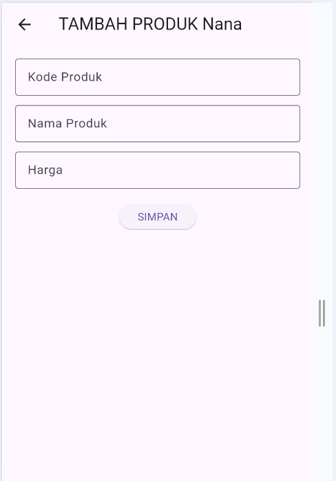
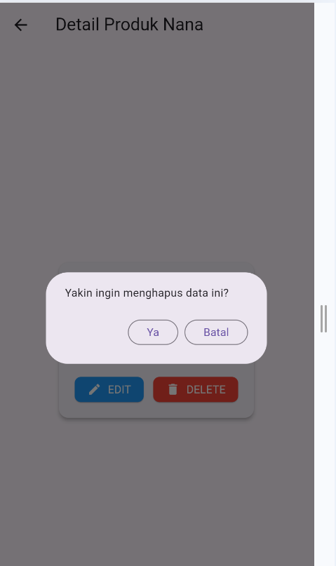
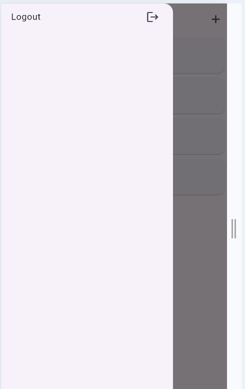
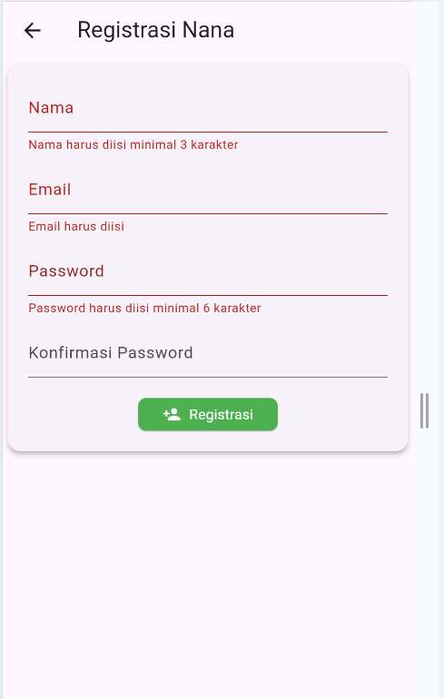

# Toko Kita - Aplikasi Manajemen Produk

# TUGAS 8 - PERTEMUAN 10

**Nama:** Fina Julianti  
**NIM:** H1D023119  
**Shift:** E  
**Program Studi:** Informatika  
**Universitas:** Universitas Jenderal Soedirman  
**Mata Kuliah:** Pemrograman Mobile

**Deskripsi:** Aplikasi manajemen produk sederhana menggunakan Flutter dengan fitur Login, Registrasi, dan CRUD Produk.

---

## Fitur Aplikasi
1. Login  
2. Registrasi  
3. List Produk  
4. Tambah Produk  
5. Detail Produk  
6. Edit Produk  
7. Hapus Produk  

---

## Screenshot Aplikasi  

Berikut daftar file screenshot beserta linknya:

### 1. Halaman Login  


### 2. Halaman Registrasi  


### 3. Halaman List Produk  


### 4. Halaman Tambah Produk  


### 5. Halaman Ubah Produk  


### 6. Halaman Detail Produk  


### 7. Halaman Hapus Produk  


### 8. Sidebar Logout  


### 9. Alert Login Tidak Diisi Field  


### 10. Alert Registrasi Tidak Diisi Field  


### 11. Alert Tambah Produk Tidak Diisi Field  


---

## Struktur Model + Penjelasan Kode

### Model Produk
```dart
class Produk {
  int? id;
  String? kodeProduk;
  String? namaProduk;
  int? hargaProduk;

  Produk({this.id, this.kodeProduk, this.namaProduk, this.hargaProduk});

  factory Produk.fromJson(Map<String, dynamic> obj) {
    return Produk(
      id: obj['id'],
      kodeProduk: obj['kode_produk'],
      namaProduk: obj['nama_produk'],
      hargaProduk: obj['harga'],
    );
  }
}
```
**Penjelasan:**
- `id`  ID produk dalam database  
- `kodeProduk`  Kode unik barang  
- `namaProduk`  Nama produk  
- `hargaProduk`  Harga produk  
- `factory Produk.fromJson()` mengambil data json dari response API kemudian memetakannya ke class Produk

---

### Model Login
```dart
class Login {
  int? code;
  bool? status;
  String? token;
  int? userID;
  String? userEmail;

  Login({this.code, this.status, this.token, this.userID, this.userEmail});

  factory Login.fromJson(Map<String, dynamic> obj) {
    if (obj['code'] == 200) {
      return Login(
        code: obj['code'],
        status: obj['status'],
        token: obj['data']['token'],
        userID: int.parse(obj['data']['user']['id']),
        userEmail: obj['data']['user']['email'],
      );
    } else {
      return Login(code: obj['code'], status: obj['status']);
    }
  }
}
```
**Penjelasan:**
- `code == 200`  login sukses  
- token disimpan untuk autentikasi API  
- `userEmail` & `userID` diambil dari data user  

---

### Model Registrasi
```dart
class Registrasi {
  int? code;
  bool? status;
  String? data;

  Registrasi({this.code, this.status, this.data});

  factory Registrasi.fromJson(Map<String, dynamic> obj) {
    return Registrasi(
      code: obj['code'],
      status: obj['status'],
      data: obj['data'],
    );
  }
}
```
**Penjelasan:**
- Digunakan untuk response saat registrasi  
- Jika berhasil, `status = true`

---

## Kode Login Page + Penjelasan
```dart
class LoginPage extends StatefulWidget {
  const LoginPage({Key? key}) : super(key: key);
  @override
  _LoginPageState createState() => _LoginPageState();
}

class _LoginPageState extends State<LoginPage> {
  final _formKey = GlobalKey<FormState>();
  final _emailTextboxController = TextEditingController();
  final _passwordTextboxController = TextEditingController();
```
**Penjelasan:**
- `TextEditingController()` berfungsi mengambil input user  
- `_formKey` dipakai untuk validasi form login  

```dart
  @override
  Widget build(BuildContext context) {
    return Scaffold(
      appBar: AppBar(
        title: const Text("Login Nana"),
      ),
```
**Penjelasan:**
- Mengubah title AppBar menjadi ÔÇ£Login NanaÔÇØ sesuai instruksi dosen  

```dart
      body: SingleChildScrollView(
        child: Padding(
          padding: const EdgeInsets.all(8.0),
          child: Form(
            key: _formKey,
            child: Column(
              children: [
                _emailTextField(),
                _passwordTextField(),
                _buttonLogin(),
                const SizedBox(height: 30),
                _menuRegistrasi(),
              ],
            ),
          ),
        ),
      ),
    );
  }
}
```
**Penjelasan:**
- `_emailTextField()` membuat input email  
- `_passwordTextField()` membuat input password  
- `_buttonLogin()` membuat tombol login  
- `_menuRegistrasi()` navigasi menuju halaman daftar  

---

## Kode Registrasi + Penjelasan
```dart
class RegistrasiPage extends StatefulWidget {
  const RegistrasiPage({Key? key}) : super(key: key);

  @override
  _RegistrasiPageState createState() => _RegistrasiPageState();
}
```

```dart
class _RegistrasiPageState extends State<RegistrasiPage> {
  final _formKey = GlobalKey<FormState>();
  final _namaTextboxController = TextEditingController();
  final _emailTextboxController = TextEditingController();
  final _passwordTextboxController = TextEditingController();
```
**Penjelasan:**
- Input tambahan: `Nama`  
- Tambahan juga `password konfirmasi`

```dart
  @override
  Widget build(BuildContext context) {
    return Scaffold(
      appBar: AppBar(
        title: const Text("Registrasi Nana"),
      ),
```

```dart
      body: SingleChildScrollView(
        child: Padding(
          padding: const EdgeInsets.all(8.0),
          child: Form(
            key: _formKey,
            child: Column(
              mainAxisAlignment: MainAxisAlignment.center,
              children: [
                _namaTextField(),
                _emailTextField(),
                _passwordTextField(),
                _passwordKonfirmasiTextField(),
                _buttonRegistrasi(),
              ],
            ),
          ),
        ),
      ),
    );
  }
}
```
**Penjelasan:**
- Menambahkan validasi minimal huruf  
- Cek password == konfirmasi password  

---

## Kode Form Tambah/Ubah Produk + Penjelasan
```dart
class ProdukForm extends StatefulWidget {
  final Produk? produk;
  const ProdukForm({Key? key, this.produk}) : super(key: key);
  @override
  _ProdukFormState createState() => _ProdukFormState();
}
```
**Penjelasan:**
- Jika `produk != null` berarti halaman ubah  
- Jika `produk == null` berarti tambah  

```dart
class _ProdukFormState extends State<ProdukForm> {
  final _formKey = GlobalKey<FormState>();
  String judul = "TAMBAH PRODUK";
  String tombolSubmit = "SIMPAN";
```

```dart
  @override
  void initState() {
    super.initState();
    isUpdate();
  }
```

```dart
  isUpdate() {
    if (widget.produk != null) {
      setState(() {
        judul = "UBAH PRODUK Nana";
        tombolSubmit = "UBAH";
        _kodeProdukTextboxController.text = widget.produk!.kodeProduk!;
        _namaProdukTextboxController.text = widget.produk!.namaProduk!;
        _hargaProdukTextboxController.text = widget.produk!.hargaProduk.toString();
      });
    } else {
      judul = "TAMBAH PRODUK Nana";
      tombolSubmit = "SIMPAN";
    }
  }
}
```

**Penjelasan:**
- ketika edit, form terisi otomatis  
- text tombol berubah dari SIMPAN  UBAH  
- judul AppBar berubah sesuai  

---

## Kode Detail Produk + Penjelasan
```dart
class ProdukDetail extends StatefulWidget {
  final Produk? produk;
  const ProdukDetail({Key? key, this.produk}) : super(key: key);
  @override
  _ProdukDetailState createState() => _ProdukDetailState();
}
```
**Penjelasan:**
- `produk` diterima dari layar sebelumnya  

```dart
  Widget _tombolHapusEdit() {
    return Row(
      children: [
        OutlinedButton(
          child: const Text("EDIT"),
          onPressed: () {
            Navigator.push(
              context,
              MaterialPageRoute(builder: (context) => ProdukForm(produk: widget.produk!)),
            );
          },
        ),
```
**Penjelasan:**
- pindah ke halaman edit produk  

```dart
        OutlinedButton(
          child: const Text("DELETE"),
          onPressed: () => confirmHapus(),
        ),
      ],
    );
  }
```
**Penjelasan:**
- menampilkan konfirmasi hapus  

---

# TUGAS 9 - PERTEMUAN 11 (CRUD & LOGIN)

## Deskripsi Tugas 9
Pada pertemuan ini, aplikasi dikembangkan lebih lanjut untuk menangani proses **Login** dan **CRUD (Create, Read, Update, Delete)** data produk secara penuh menggunakan API. Aplikasi kini dapat berkomunikasi dengan backend CodeIgniter 4 untuk menyimpan, mengambil, mengubah, dan menghapus data secara real-time.

## Dokumentasi dan Penjelasan Proses

### 1. Proses Registrasi
**a. Alur Aplikasi (Flow)**
1.  Pengguna membuka halaman Registrasi dan mengisi form (Nama, Email, Password, Konfirmasi Password).
2.  Tombol "Daftar" ditekan, memicu fungsi `RegistrasiBloc.registrasi()`.
3.  Flutter mengirimkan HTTP POST request ke endpoint API `/registrasi` dengan body JSON berisi data user.
4.  Backend menerima request, memvalidasi input, dan melakukan *hashing* pada password.
5.  Data disimpan ke tabel `member` di database MySQL.
6.  Backend mengembalikan respon JSON sukses (Code 200).
7.  Flutter menerima respon dan menampilkan dialog sukses atau gagal.

**b. Penjelasan Kode Backend (RegistrasiController.php)**
```php
public function registrasi() {
    // Mengambil data JSON dari request body
    $data = [
        'nama' => $this->request->getVar('nama'),
        'email' => $this->request->getVar('email'),
        // Password di-hash menggunakan algoritma default (BCRYPT) agar aman
        'password' => password_hash($this->request->getVar('password'), PASSWORD_DEFAULT)
    ];
    
    // Memanggil Model MRegistrasi untuk menyimpan data ke database
    $model = new MRegistrasi();
    $model->save($data);
    
    // Mengembalikan respon JSON sukses
    return $this->responseHasil(200, true, "Registrasi Berhasil");
}
```
*Penjelasan Detail:*
Fungsi `registrasi` bertugas menangani pendaftaran user baru. Data nama dan email diambil langsung dari input. Password tidak disimpan mentah, melainkan dienkripsi menggunakan `password_hash` demi keamanan. Setelah data siap, `MRegistrasi` digunakan untuk menyimpan data ke tabel. Terakhir, fungsi `responseHasil` mengirimkan status 200 OK ke aplikasi Flutter.

**c. Penjelasan Kode Frontend (RegistrasiBloc.dart)**
```dart
static Future<Registrasi> registrasi({String? nama, String? email, String? password}) async {
  // Menentukan URL endpoint registrasi
  String apiUrl = ApiUrl.registrasi;
  
  // Membungkus data dalam format Map/JSON
  var body = {"nama": nama, "email": email, "password": password};
  
  // Mengirim request POST ke backend
  var response = await Api().post(apiUrl, body);
  
  // Mendecode respon JSON dari backend menjadi objek Dart
  var jsonObj = json.decode(response.body);
  
  // Mengembalikan objek Registrasi yang berisi status dan pesan
  return Registrasi.fromJson(jsonObj);
}
```
*Penjelasan Detail:*
Fungsi ini adalah jembatan antara UI dan API. Ia menerima input dari form, mengubahnya menjadi format JSON, dan mengirimkannya ke server menggunakan method `POST`. Hasil balikan dari server (response body) kemudian diurai (`decode`) dan dikonversi menjadi objek model `Registrasi` agar mudah dicek status keberhasilannya di UI.

**d. Screenshot**
<br>

<br>
*Gambar: Form Registrasi*

<br>

<br>
*Gambar: Alert jika registrasi gagal (validasi)*

---

### 2. Proses Login
**a. Alur Aplikasi (Flow)**
1.  Pengguna memasukkan Email dan Password di halaman Login.
2.  Tombol "Login" ditekan, memicu `LoginBloc.login()`.
3.  Flutter mengirim HTTP POST ke `/login`.
4.  Backend mencari user berdasarkan email. Jika ketemu, password diverifikasi (`password_verify`).
5.  Jika cocok, Backend membuat **Token** sesi dan mengirimkannya bersama data user.
6.  Flutter menerima token, menyimpannya di penyimpanan lokal (`SharedPreferences` via `UserInfo`), dan mengarahkan user ke halaman Produk.

**b. Penjelasan Kode Backend (LoginController.php)**
```php
public function login() {
    $email = $this->request->getVar('email');
    $password = $this->request->getVar('password');
    
    // Mencari user di database berdasarkan email
    $model = new MMember();
    $member = $model->where('email', $email)->first();
    
    // Verifikasi: Apakah user ada? Apakah password cocok dengan hash di DB?
    if (!$member || !password_verify($password, $member['password'])) {
        return $this->responseHasil(400, false, "Login Gagal");
    }
    
    // Jika sukses, buat token (di sini simulasi token sederhana)
    $data = [
        'token' => 'token_sederhana_123', 
        'user' => $member
    ];
    
    return $this->responseHasil(200, true, $data);
}
```
*Penjelasan Detail:*
Controller ini memvalidasi kredensial pengguna. Kunci utamanya adalah `password_verify($password, $member['password'])` yang membandingkan password inputan user dengan hash password yang tersimpan di database. Jika cocok, server memberikan "kunci akses" berupa token yang wajib disertakan oleh Flutter dalam request-request selanjutnya (seperti tambah/hapus produk).

**c. Penjelasan Kode Frontend (LoginBloc.dart)**
```dart
static Future<Login> login({String? email, String? password}) async {
  String apiUrl = ApiUrl.login;
  var body = {"email": email, "password": password};
  
  // Request POST ke API Login
  var response = await Api().post(apiUrl, body);
  var jsonObj = json.decode(response.body);
  
  // Mengembalikan objek Login yang berisi Token dan User ID
  return Login.fromJson(jsonObj);
}
```
*Penjelasan Detail:*
Fungsi ini mengirim kredensial ke server. Yang paling penting di sini adalah pengolahan responnya. Objek `Login` yang dikembalikan akan berisi `token`. Di UI (`LoginPage`), kita akan mengecek `code == 200`. Jika ya, token tersebut disimpan menggunakan `UserInfo().setToken(...)`. Tanpa token ini, user tidak akan dianggap "login" dan tidak bisa mengakses fitur CRUD.

**d. Screenshot**
<br>

<br>
*Gambar: Form Login*

<br>

<br>
*Gambar: Alert Login Gagal*

<br>

<br>
*Gambar: Alert Login Berhasil*

---

### 3. Proses Tambah Data Produk (Create)
**a. Alur Aplikasi (Flow)**
1.  User menekan tombol tambah (+) dan mengisi form produk.
2.  Tombol "Simpan" ditekan, memicu `ProdukBloc.addProduk()`.
3.  Flutter mengirim HTTP POST ke `/produk` dengan data produk.
4.  Backend menerima data dan menyimpannya ke tabel `produk`.
5.  Jika sukses, Flutter kembali ke halaman list dan me-refresh tampilan.

**b. Penjelasan Kode Backend (ProdukController.php - create)**
```php
public function create() {
    // Mengambil input dari Flutter
    $data = [
        'kode_produk' => $this->request->getVar('kode_produk'),
        'nama_produk' => $this->request->getVar('nama_produk'),
        'harga' => $this->request->getVar('harga')
    ];
    
    // Insert data ke tabel produk
    $model = new MProduk();
    $model->insert($data);
    
    return $this->responseHasil(200, true, "Produk Berhasil Ditambahkan");
}
```
*Penjelasan Detail:*
Fungsi ini sangat lugas: menerima data, memasukkannya ke array `$data`, lalu memanggil `$model->insert($data)` untuk menulisnya ke database. Tidak ada validasi kompleks di sini untuk penyederhanaan, namun data `harga` yang diterima sebagai string dari Flutter akan disimpan sebagai integer/decimal di database sesuai struktur tabel.

**c. Penjelasan Kode Frontend (ProdukBloc.dart)**
```dart
static Future addProduk({Produk? produk}) async {
  String apiUrl = ApiUrl.createProduk;
  
  var body = {
    "kode_produk": produk!.kodeProduk,
    "nama_produk": produk.namaProduk,
    // Konversi harga ke String agar aman saat dikirim via JSON
    "harga": produk.hargaProduk.toString()
  };
  
  var response = await Api().post(apiUrl, body);
  var jsonObj = json.decode(response.body);
  
  // Mengembalikan status (true/false)
  return jsonObj['status'];
}
```
*Penjelasan Detail:*
Di sini kita mengemas objek `Produk` menjadi JSON. Perhatikan bahwa `hargaProduk` dikonversi `.toString()` sebelum dikirim. Ini untuk menghindari masalah tipe data di beberapa konfigurasi server yang mungkin bingung menerima integer mentah dalam JSON body. Fungsi ini mengembalikan status boolean agar UI tahu apakah harus menutup form dan menampilkan pesan sukses atau tidak.

**d. Screenshot**
<br>

<br>
*Gambar: Form Tambah Produk*

<br>

<br>
*Gambar: Produk baru muncul di list*

---

### 4. Proses Tampil Data Produk (Read)
**a. Alur Aplikasi (Flow)**
1.  Halaman `ProdukPage` dibuka.
2.  `FutureBuilder` memanggil `ProdukBloc.getProduks()`.
3.  Flutter mengirim HTTP GET ke `/produk`.
4.  Backend mengambil seluruh baris data dari tabel `produk`.
5.  Backend mengirimkan data dalam format JSON Array.
6.  Flutter mengubah JSON Array menjadi `List<Produk>` dan menampilkannya di `ListView`.

**b. Penjelasan Kode Backend (ProdukController.php - index)**
```php
public function index() {
    $model = new MProduk();
    // Mengambil SEMUA data dari tabel produk
    $produk = $model->findAll();
    
    // Mengirimkan data produk sebagai respon JSON
    return $this->responseHasil(200, true, $produk);
}
```
*Penjelasan Detail:*
Method `index` adalah endpoint default untuk GET. `$model->findAll()` adalah fitur bawaan CodeIgniter Model untuk melakukan query `SELECT * FROM produk`. Hasilnya berupa array of objects yang langsung dikirimkan ke klien (Flutter).

**c. Penjelasan Kode Frontend (ProdukPage.dart)**
```dart
// Widget FutureBuilder untuk menangani data async
FutureBuilder<List<Produk>>(
  future: ProdukBloc.getProduks(), // Memanggil API
  builder: (context, snapshot) {
    if (snapshot.hasError) debugPrint(snapshot.error.toString());
    
    // Jika data ada, tampilkan List. Jika belum, tampilkan Loading.
    return snapshot.hasData
        ? ListProduk(list: snapshot.data)
        : const Center(child: CircularProgressIndicator());
  },
)
```
*Penjelasan Detail:*
Kita menggunakan `FutureBuilder` karena pengambilan data dari internet butuh waktu (asynchronous). Saat `future` sedang berjalan (waiting), kita menampilkan `CircularProgressIndicator` (loading spinner). Begitu data sampai (`snapshot.hasData`), kita oper data tersebut ke widget `ListProduk` untuk dirender menjadi daftar kartu produk.

**d. Screenshot**
<br>

<br>
*Gambar: List Produk*

---

### 5. Proses Ubah Data Produk (Update)
**a. Alur Aplikasi (Flow)**
1.  User memilih produk dan menekan "Edit".
2.  Form terbuka dengan data lama terisi otomatis.
3.  User mengubah data dan menekan "Ubah".
4.  Flutter mengirim HTTP PUT ke `/produk/{id}`.
5.  Backend menerima ID dan data baru, lalu melakukan update di database.

**b. Penjelasan Kode Backend (ProdukController.php - update)**
```php
public function update($id) {
    // Mengambil data JSON mentah (Raw Input) karena method PUT
    $data = $this->request->getRawInput();
    
    $model = new MProduk();
    // Update data pada baris dengan ID yang sesuai
    $model->update($id, $data);
    
    return $this->responseHasil(200, true, "Produk Berhasil Diubah");
}
```
*Penjelasan Detail:*
Untuk update, kita menggunakan method HTTP `PUT`. Di CodeIgniter, data PUT tidak bisa diambil via `getVar()` biasa, jadi kita pakai `getRawInput()`. Fungsi `$model->update($id, $data)` akan mencari baris dengan primary key `$id` dan mengganti kolom-kolomnya dengan nilai baru dari `$data`.

**c. Penjelasan Kode Frontend (ProdukBloc.dart)**
```dart
static Future updateProduk({required Produk produk}) async {
  // Menyertakan ID produk di URL endpoint
  String apiUrl = ApiUrl.updateProduk(produk.id!);
  
  var body = {
    "kode_produk": produk.kodeProduk,
    "nama_produk": produk.namaProduk,
    "harga": produk.hargaProduk.toString()
  };
  
  // Mengirim request PUT
  var response = await Api().put(apiUrl, jsonEncode(body));
  var jsonObj = json.decode(response.body);
  return jsonObj['status'];
}
```
*Penjelasan Detail:*
Perbedaan utama dengan Create adalah URL-nya spesifik menunjuk ke ID produk (`ApiUrl.updateProduk(produk.id!)`) dan method yang digunakan adalah `PUT`. Kita juga harus memastikan ID produk tidak null karena itu adalah kunci pencarian di database.

**d. Screenshot**
<br>

<br>
*Gambar: Detail Sebelum Edit*

<br>

<br>
*Gambar: Form Edit*

<br>

<br>
*Gambar: Detail Setelah Edit*

---

### 6. Proses Hapus Data Produk (Delete)
**a. Alur Aplikasi (Flow)**
1.  User menekan tombol "Delete" di detail produk.
2.  Muncul dialog konfirmasi "Yakin ingin menghapus?".
3.  Jika "Ya", Flutter mengirim HTTP DELETE ke `/produk/{id}`.
4.  Backend menghapus baris data dengan ID tersebut.
5.  Flutter mengarahkan user kembali ke List Produk.

**b. Penjelasan Kode Backend (ProdukController.php - delete)**
```php
public function delete($id) {
    $model = new MProduk();
    // Menghapus permanen data berdasarkan ID
    $model->delete($id);
    
    return $this->responseHasil(200, true, "Produk Berhasil Dihapus");
}
```
*Penjelasan Detail:*
Fungsi ini paling sederhana. Ia hanya butuh ID. `$model->delete($id)` akan mengeksekusi query `DELETE FROM produk WHERE id = $id`. Data yang dihapus tidak bisa dikembalikan (kecuali pakai soft delete, tapi di sini kita pakai hard delete).

**c. Penjelasan Kode Frontend (ProdukBloc.dart)**
```dart
static Future<bool> deleteProduk({int? id}) async {
  String apiUrl = ApiUrl.deleteProduk(id!);
  
  // Mengirim request DELETE
  var response = await Api().delete(apiUrl);
  var jsonObj = json.decode(response.body);
  
  // Mengembalikan data (biasanya boolean true)
  return (jsonObj as Map<String, dynamic>)['data'];
}
```
*Penjelasan Detail:*
Kita memanggil API dengan method `DELETE`. Setelah berhasil, biasanya kita tidak butuh data balikan yang kompleks, cukup konfirmasi sukses. Di UI, setelah fungsi ini return `true`, kita menggunakan `Navigator.push(...)` atau `pop` untuk kembali ke halaman list agar user tidak tetap berada di halaman detail produk yang datanya sudah hilang.

**d. Screenshot**
<br>

<br>
*Gambar: Konfirmasi Hapus*

<br>

<br>
*Gambar: Produk hilang dari list*

