# Toko Kita - Aplikasi Manajemen Produk

**TUGAS 8 - PERTEMUAN 10**

* **Nama:** Fina Julianti
* **NIM:** H1D023119
* **Shift:** E
* **Program Studi:** Informatika
* **Universitas:** Universitas Jenderal Soedirman
* **Mata Kuliah:** Pemrograman Mobile

---

## Deskripsi
Aplikasi manajemen produk sederhana menggunakan Flutter dengan fitur Login, Registrasi, dan CRUD (Create, Read, Update, Delete) Produk. Aplikasi ini dirancang untuk memenuhi tugas pertemuan 10 dengan implementasi antarmuka pengguna (UI) yang lengkap.

---

## Fitur Aplikasi

1. **Login** — Halaman autentikasi pengguna
2. **Registrasi** — Membuat akun baru
3. **List Produk** — Menampilkan daftar produk
4. **Tambah Produk** — Input data produk
5. **Detail Produk** — Menampilkan detail produk
6. **Edit Produk** — Mengubah data produk
7. **Hapus Produk** — Menghapus produk

---

## Penjelasan Kode (Tugas 8)

### 1. Halaman Login Nana

**Penjelasan Kode:**
```dart
class LoginPage extends StatefulWidget {
  const LoginPage({Key? key}) : super(key: key);
  @override
  _LoginPageState createState() => _LoginPageState();
}
...
```

**Komponen Utama:**
- GlobalKey<FormState>
- TextEditingController
- TextFormField
- ElevatedButton
- InkWell

---

### 2. Halaman Registrasi Nana

**Penjelasan Kode:**
```dart
class RegistrasiPage extends StatefulWidget {
  ...
}
```

**Validasi Input:**
- Nama minimal 3 karakter
- Email valid
- Password minimal 6 karakter
- Konfirmasi password sama

---

### 3. Halaman List Produk Nana

**Penjelasan Kode:**
```dart
class ProdukPage extends StatefulWidget {
  ...
}
```

**Komponen Utama:**
- AppBar
- Drawer / Logout
- ListView + ItemProduk

---

### 4. Halaman Tambah Produk Nana

**Penjelasan Kode:**
```dart
class ProdukForm extends StatefulWidget {
  ...
}
```

**Fungsi `isUpdate()`** menentukan mode TAMBAH atau EDIT.

---

### 5. Halaman Detail Produk Nana

**Penjelasan Kode:**
```dart
class ProdukDetail extends StatefulWidget {
  ...
}
```

Menampilkan detail informasi produk + tombol Edit & Delete.

---

## Struktur Model

### Model Produk
```dart
class Produk {
  ...
}
```

### Model Login
```dart
class Login {
  int? code;
  bool? status;
  String? token;
  int? userID;
  String? userEmail;

  Login({this.code, this.status, this.token, this.userID, this.userEmail});

  factory Login.fromJson(Map<String, dynamic> obj) {
    if (obj['code'] == 200) {
      return Login(
        status: obj['status'],
        token: obj['data']['token'],
        userID: int.parse(obj['data']['user']['id']),
        userEmail: obj['data']['user']['email'],
      );
    } else {
      return Login(code: obj['code'], status: obj['status']);
    }
  }
}
```

### Model Registrasi
```dart
class Registrasi {
  int? code;
  bool? status;

  Registrasi({this.code, this.status, this.data});

  factory Registrasi.fromJson(Map<String, dynamic> obj) {
    return Registrasi(
      code: obj['code'],
      status: obj['status'],
      data: obj['data'],
    );
  }
}
```

---

# Struktur Folder Project

```
lib/
│
├── model/
│   ├── produk.dart
│   ├── login.dart
│   └── registrasi.dart
│
├── ui/
│   ├── login_page.dart
│   ├── registrasi_page.dart
│   ├── produk_page.dart
│   ├── produk_form.dart
│   ├── produk_detail.dart
│   ├── item_produk.dart
│
└── main.dart
```

---

# Cara Menjalankan Aplikasi

### 1. Clone repository
```bash
git clone https://github.com/yourusername/toko-kita.git
```

### 2. Masuk ke folder project
```bash
cd toko-kita
```

### 3. Install dependency
```bash
flutter pub get
```

### 4. Running di emulator / device
```bash
flutter run
```

---
## Catatan Perubahan

### Modifikasi yang Dilakukan:
1. Menambahkan nama "Nana" pada setiap AppBar.
2. Memperbaiki kode dengan menghapus variabel yang tidak digunakan.
3. Implementasi UI lengkap sesuai modul pertemuan 10.

---

## 🎯 Teknologi yang Digunakan

- **Flutter SDK**: ^3.9.2
- **Dart**: ^3.9.2
- **Material Design**: Untuk UI Components

---

**TUGAS 9 - PERTEMUAN 11 (CRUD & LOGIN)**

## Deskripsi Tugas 9
Pada pertemuan ini, aplikasi dikembangkan lebih lanjut untuk menangani proses **Login** dan **CRUD (Create, Read, Update, Delete)** data produk secara penuh menggunakan API.

## Dokumentasi dan Penjelasan Proses

### 1. Proses Registrasi
**a. Alur Aplikasi**
1.  Pengguna mengisi form registrasi (Nama, Email, Password).
2.  Flutter mengirim request POST ke API `/registrasi`.
3.  Backend menyimpan data ke tabel `member`.
4.  Jika sukses, backend mengembalikan respon JSON.

**b. Screenshot**
<br>
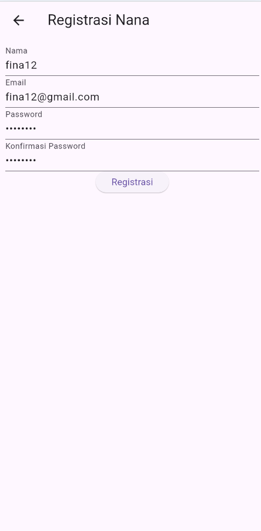
<br>
*Gambar: Form Registrasi*

<br>
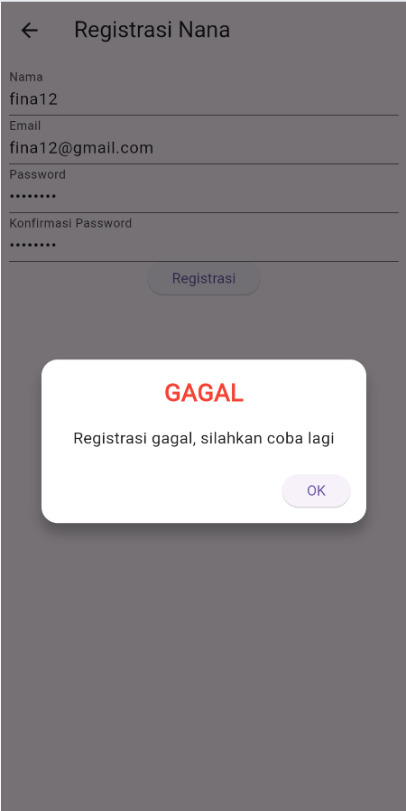
<br>
*Gambar: Alert jika registrasi gagal (validasi)*

**c. Kode Implementasi**
**Backend (RegistrasiController.php):**
```php
public function registrasi() {
    $data = [
        'nama' => $this->request->getVar('nama'),
        'email' => $this->request->getVar('email'),
        'password' => password_hash($this->request->getVar('password'), PASSWORD_DEFAULT)
    ];
    $model = new MRegistrasi();
    $model->save($data);
    return $this->responseHasil(200, true, "Registrasi Berhasil");
}
```

**Frontend (RegistrasiBloc.dart):**
```dart
static Future<Registrasi> registrasi({String? nama, String? email, String? password}) async {
  String apiUrl = ApiUrl.registrasi;
  var body = {"nama": nama, "email": email, "password": password};
  var response = await Api().post(apiUrl, body);
  var jsonObj = json.decode(response.body);
  return Registrasi.fromJson(jsonObj);
}
```

---

### 2. Proses Login
**a. Alur Aplikasi**
1.  Pengguna memasukkan Email dan Password.
2.  Flutter mengirim request POST ke API `/login`.
3.  Backend memverifikasi email dan password (menggunakan `password_verify`).
4.  Jika valid, backend mengirimkan **Token** dan data User.
5.  Flutter menyimpan token (untuk sesi) dan mengarahkan ke halaman Produk.

**b. Screenshot**
<br>
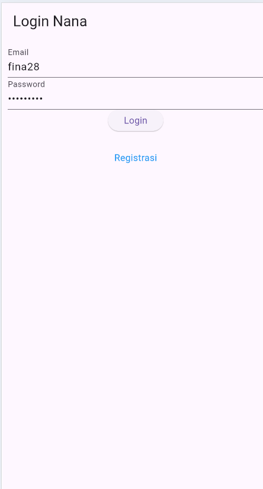
<br>
*Gambar: Form Login*

<br>
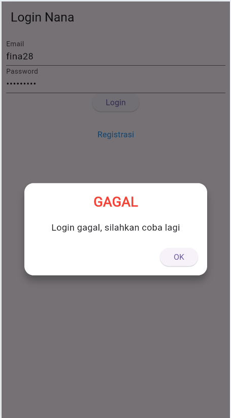
<br>
*Gambar: Alert Login Gagal*

<br>
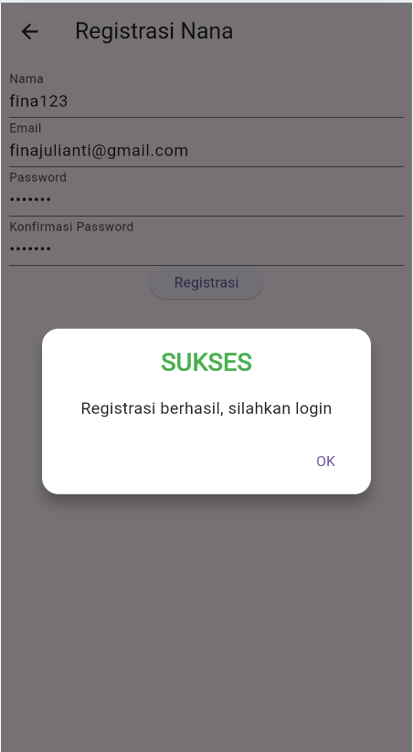
<br>
*Gambar: Alert Login Berhasil*

**c. Kode Implementasi**
**Backend (LoginController.php):**
```php
public function login() {
    $email = $this->request->getVar('email');
    $password = $this->request->getVar('password');
    $model = new MMember();
    $member = $model->where('email', $email)->first();
    
    if (!$member || !password_verify($password, $member['password'])) {
        return $this->responseHasil(400, false, "Login Gagal");
    }
    
    $data = ['token' => '...', 'user' => $member];
    return $this->responseHasil(200, true, $data);
}
```

**Frontend (LoginBloc.dart):**
```dart
static Future<Login> login({String? email, String? password}) async {
  String apiUrl = ApiUrl.login;
  var body = {"email": email, "password": password};
  var response = await Api().post(apiUrl, body);
  return Login.fromJson(json.decode(response.body));
}
```

---

### 3. Proses Tambah Data Produk (Create)
**a. Alur Aplikasi**
1.  Pengguna mengisi form produk.
2.  Flutter mengirim request POST ke API `/produk`.
3.  Backend menerima data dan menyimpannya ke tabel `produk`.

**b. Screenshot**
<br>
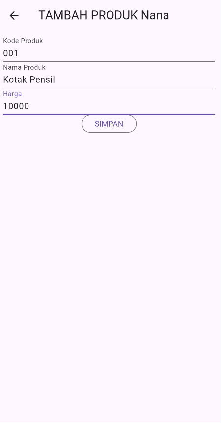
<br>
*Gambar: Form Tambah Produk*

<br>
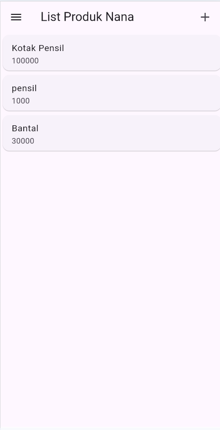
<br>
*Gambar: Produk baru muncul di list*

**c. Kode Implementasi**
**Backend (ProdukController.php - create):**
```php
public function create() {
    $data = [
        'kode_produk' => $this->request->getVar('kode_produk'),
        'nama_produk' => $this->request->getVar('nama_produk'),
        'harga' => $this->request->getVar('harga')
    ];
    $model = new MProduk();
    $model->insert($data);
    return $this->responseHasil(200, true, "Produk Berhasil Ditambahkan");
}
```

**Frontend (ProdukBloc.dart):**
```dart
static Future addProduk({Produk? produk}) async {
  String apiUrl = ApiUrl.createProduk;
  var body = {
    "kode_produk": produk!.kodeProduk,
    "nama_produk": produk.namaProduk,
    "harga": produk.hargaProduk.toString()
  };
  var response = await Api().post(apiUrl, body);
  return json.decode(response.body)['status'];
}
```

---

### 4. Proses Tampil Data Produk (Read)
**a. Alur Aplikasi**
1.  Halaman Produk dibuka.
2.  Flutter memanggil API GET `/produk`.
3.  Backend mengambil semua data dari tabel `produk` dan mengembalikannya sebagai JSON.
4.  Flutter menampilkan data dalam `ListView`.

**b. Screenshot**
<br>
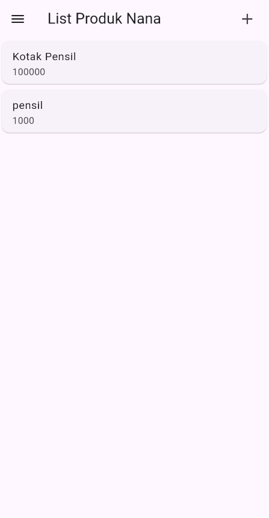
<br>
*Gambar: List Produk*

**c. Kode Implementasi**
**Backend (ProdukController.php - index):**
```php
public function index() {
    $model = new MProduk();
    $produk = $model->findAll();
    return $this->responseHasil(200, true, $produk);
}
```

**Frontend (ProdukPage.dart):**
```dart
FutureBuilder<List<Produk>>(
  future: ProdukBloc.getProduks(),
  builder: (context, snapshot) {
    if (snapshot.hasData) return ListProduk(list: snapshot.data);
    return CircularProgressIndicator();
  },
)
```

---

### 5. Proses Ubah Data Produk (Update)
**a. Alur Aplikasi**
1.  Pengguna mengedit data di form.
2.  Flutter mengirim request PUT ke API `/produk/{id}`.
3.  Backend mengupdate data di database berdasarkan ID.

**b. Screenshot**
<br>
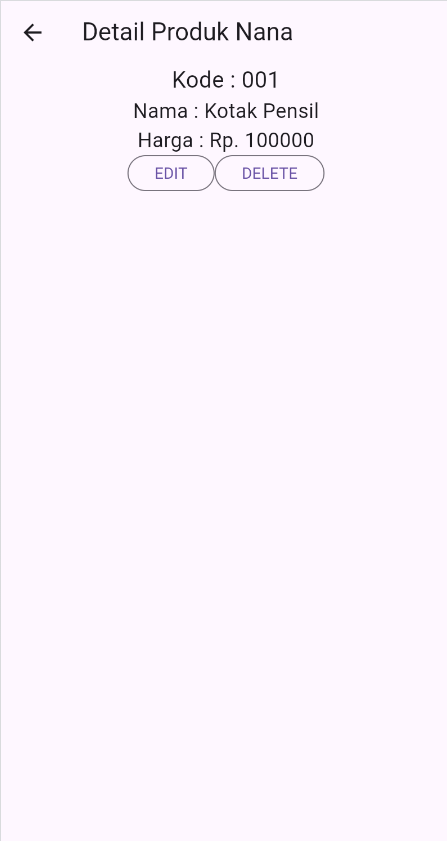
<br>
*Gambar: Detail Sebelum Edit*

<br>

<br>
*Gambar: Form Edit*

<br>
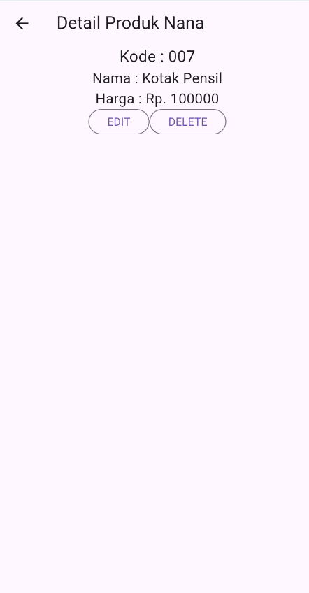
<br>
*Gambar: Detail Setelah Edit*

**c. Kode Implementasi**
**Backend (ProdukController.php - update):**
```php
public function update($id) {
    $data = $this->request->getRawInput();
    $model = new MProduk();
    $model->update($id, $data);
    return $this->responseHasil(200, true, "Produk Berhasil Diubah");
}
```

**Frontend (ProdukBloc.dart):**
```dart
static Future updateProduk({required Produk produk}) async {
  String apiUrl = ApiUrl.updateProduk(produk.id!);
  var body = {...};
  var response = await Api().put(apiUrl, jsonEncode(body));
  return json.decode(response.body)['status'];
}
```

---

### 6. Proses Hapus Data Produk (Delete)
**a. Alur Aplikasi**
1.  Pengguna menekan tombol Hapus dan mengonfirmasi dialog.
2.  Flutter mengirim request DELETE ke API `/produk/{id}`.
3.  Backend menghapus data dari database.

**b. Screenshot**
<br>
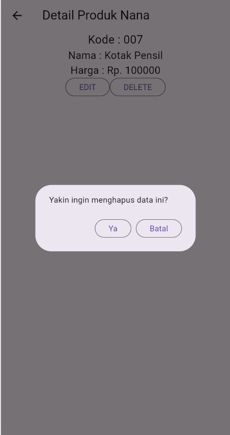
<br>
*Gambar: Konfirmasi Hapus*

<br>
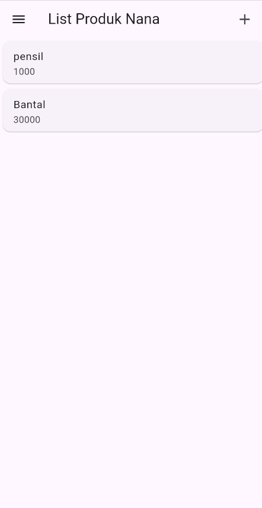
<br>
*Gambar: Produk hilang dari list*

**c. Kode Implementasi**
**Backend (ProdukController.php - delete):**
```php
public function delete($id) {
    $model = new MProduk();
    $model->delete($id);
    return $this->responseHasil(200, true, "Produk Berhasil Dihapus");
}
```

**Frontend (ProdukBloc.dart):**
```dart
static Future<bool> deleteProduk({int? id}) async {
  String apiUrl = ApiUrl.deleteProduk(id!);
  var response = await Api().delete(apiUrl);
  return json.decode(response.body)['data'];
}
```
