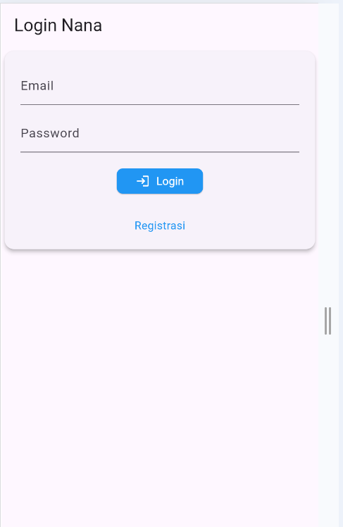
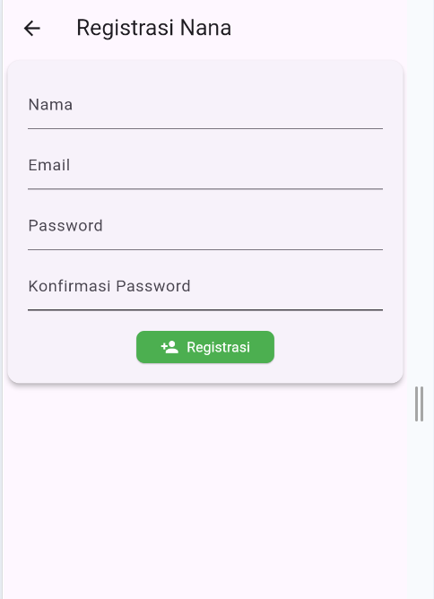
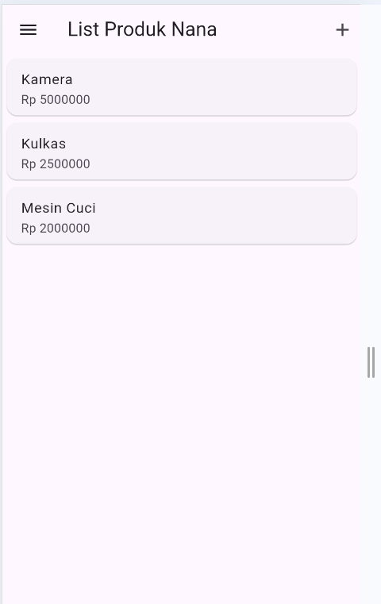
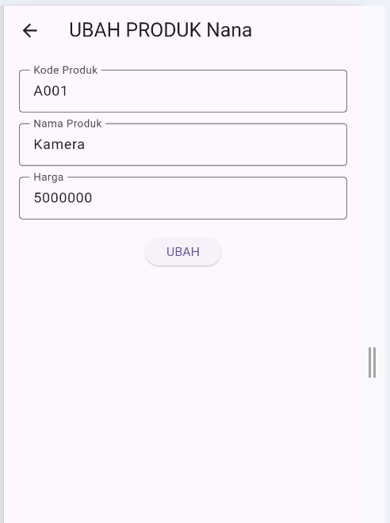
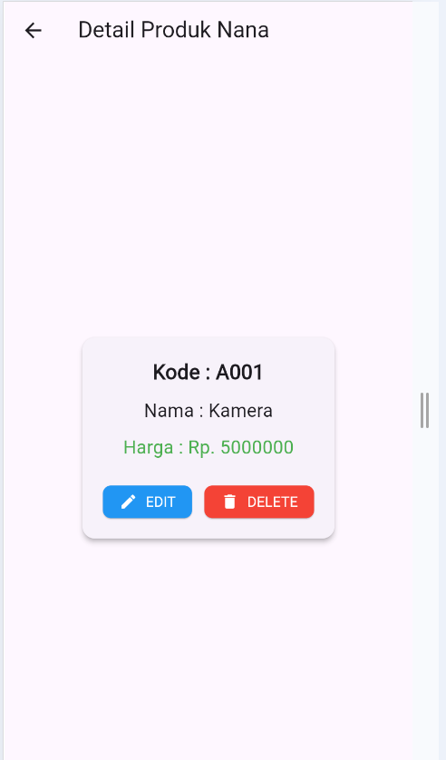
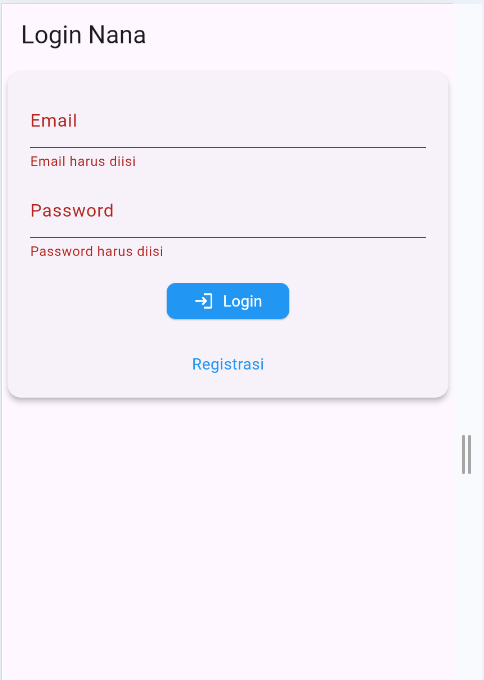
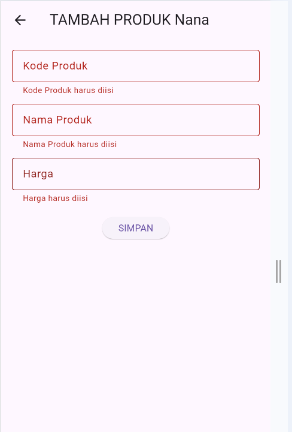

# Toko Kita - Aplikasi Manajemen Produk

**TUGAS 8 - PERTEMUAN 10**

**Nama:** Fina Julianti  
**NIM:** H1D023119  
**Shift:** E  
**Program Studi:** Informatika  
**Universitas:** Universitas Jenderal Soedirman  
**Mata Kuliah:** Pemrograman Mobile

**Deskripsi:** Aplikasi manajemen produk sederhana menggunakan Flutter dengan fitur Login, Registrasi, dan CRUD Produk.

---

## 📱 Fitur Aplikasi

1. **Login** - Halaman untuk masuk ke aplikasi
2. **Registrasi** - Halaman untuk mendaftar akun baru
3. **List Produk** - Menampilkan daftar produk
4. **Tambah Produk** - Menambah produk baru
5. **Detail Produk** - Melihat detail produk
6. **Edit Produk** - Mengubah data produk
7. **Hapus Produk** - Menghapus produk

---

## 📸 Screenshot Aplikasi


### 🎥 Demo Aplikasi
> Tambahkan link video demo aplikasi di sini (jika ada)

---

### 1. Halaman Login


### 2. Halaman Registrasi


### 3. Halaman List Produk


### 4. Halaman Tambah Produk


### 5. Halaman Ubah Produk


### 6. Halaman Detail Produk


### 7. Halaman Hapus Produk


### 8. Sidebar Logout


### 9. Alert Login Tidak Diisi Field


### 10. Alert Registrasi Tidak Diisi Field


### 11. Alert Tambah Produk Tidak Diisi Field


**Penjelasan Kode:**
```dart
class LoginPage extends StatefulWidget {
  const LoginPage({Key? key}) : super(key: key);
  @override
  _LoginPageState createState() => _LoginPageState();
}

class _LoginPageState extends State<LoginPage> {
  final _formKey = GlobalKey<FormState>();
  final _emailTextboxController = TextEditingController();
  final _passwordTextboxController = TextEditingController();

  @override
  Widget build(BuildContext context) {
    return Scaffold(
      appBar: AppBar(
        title: const Text("Login Nana"),
      ),
      body: SingleChildScrollView(
        child: Padding(
          padding: const EdgeInsets.all(8.0),
          child: Form(
            key: _formKey,
            child: Column(
              children: [
                _emailTextField(),
                _passwordTextField(),
                _buttonLogin(),
                const SizedBox(height: 30),
                _menuRegistrasi(),
              ],
            ),
          ),
        ),
      ),
    );
  }
}
```

**Komponen Utama:**
- `GlobalKey<FormState>`: Untuk validasi form
- `TextEditingController`: Mengontrol input email dan password
- `TextFormField`: Input field dengan validasi
- `ElevatedButton`: Tombol login
- `InkWell`: Navigasi ke halaman registrasi

---

### 2. Halaman Registrasi Nana


**Penjelasan Kode:**
```dart
class RegistrasiPage extends StatefulWidget {
  const RegistrasiPage({Key? key}) : super(key: key);

  @override
  _RegistrasiPageState createState() => _RegistrasiPageState();
}

class _RegistrasiPageState extends State<RegistrasiPage> {
  final _formKey = GlobalKey<FormState>();
  final _namaTextboxController = TextEditingController();
  final _emailTextboxController = TextEditingController();
  final _passwordTextboxController = TextEditingController();

  @override
  Widget build(BuildContext context) {
    return Scaffold(
      appBar: AppBar(
        title: const Text("Registrasi Nana"),
      ),
      body: SingleChildScrollView(
        child: Padding(
          padding: const EdgeInsets.all(8.0),
          child: Form(
            key: _formKey,
            child: Column(
              mainAxisAlignment: MainAxisAlignment.center,
              children: [
                _namaTextField(),
                _emailTextField(),
                _passwordTextField(),
                _passwordKonfirmasiTextField(),
                _buttonRegistrasi(),
              ],
            ),
          ),
        ),
      ),
    );
  }
}
```

**Komponen Utama:**
- Input field: Nama, Email, Password, Konfirmasi Password
- Validasi: 
  - Nama minimal 3 karakter
  - Email harus diisi
  - Password minimal 6 karakter
  - Password konfirmasi harus sama dengan password

---

### 3. Halaman List Produk Nana


**Penjelasan Kode:**
```dart
class ProdukPage extends StatefulWidget {
  const ProdukPage({Key? key}) : super(key: key);
  @override
  _ProdukPageState createState() => _ProdukPageState();
}

class _ProdukPageState extends State<ProdukPage> {
  @override
  Widget build(BuildContext context) {
    return Scaffold(
      appBar: AppBar(
        title: const Text("List Produk Nana"),
        actions: [
          Padding(
            padding: const EdgeInsets.only(right: 20.0),
            child: GestureDetector(
              child: const Icon(Icons.add, size: 26.0),
              onTap: () async {
                Navigator.push(
                  context,
                  MaterialPageRoute(builder: (context) => const ProdukForm()),
                );
              },
            ),
          ),
        ],
      ),
      drawer: Drawer(
        child: ListView(
          children: [
            ListTile(
              title: const Text('Logout'),
              trailing: const Icon(Icons.logout),
              onTap: () async {},
            ),
          ],
        ),
      ),
      body: ListView(
        children: [
          ItemProduk(produk: Produk(id: 1, kodeProduk: 'A001', namaProduk: 'Kamera', hargaProduk: 5000000)),
          ItemProduk(produk: Produk(id: 2, kodeProduk: 'A002', namaProduk: 'Kulkas', hargaProduk: 2500000)),
          ItemProduk(produk: Produk(id: 3, kodeProduk: 'A003', namaProduk: 'Mesin Cuci', hargaProduk: 2000000)),
        ],
      ),
    );
  }
}
```

**Komponen Utama:**
- `AppBar` dengan action button (+) untuk tambah produk
- `Drawer` untuk menu logout
- `ListView` menampilkan daftar produk
- `GestureDetector` pada setiap item untuk navigasi ke detail
- Data dummy produk: Kamera, Kulkas, Mesin Cuci

---

### 4. Halaman Tambah Produk Nana


**Penjelasan Kode:**
```dart
class ProdukForm extends StatefulWidget {
  final Produk? produk;
  const ProdukForm({Key? key, this.produk}) : super(key: key);
  @override
  _ProdukFormState createState() => _ProdukFormState();
}

class _ProdukFormState extends State<ProdukForm> {
  final _formKey = GlobalKey<FormState>();
  String judul = "TAMBAH PRODUK";
  String tombolSubmit = "SIMPAN";

  final _kodeProdukTextboxController = TextEditingController();
  final _namaProdukTextboxController = TextEditingController();
  final _hargaProdukTextboxController = TextEditingController();

  @override
  void initState() {
    super.initState();
    isUpdate();
  }

  isUpdate() {
    if (widget.produk != null) {
      setState(() {
        judul = "UBAH PRODUK Nana";
        tombolSubmit = "UBAH";
        _kodeProdukTextboxController.text = widget.produk!.kodeProduk!;
        _namaProdukTextboxController.text = widget.produk!.namaProduk!;
        _hargaProdukTextboxController.text = widget.produk!.hargaProduk.toString();
      });
    } else {
      judul = "TAMBAH PRODUK Nana";
      tombolSubmit = "SIMPAN";
    }
  }
}
```

**Komponen Utama:**
- Form dengan 3 input: Kode Produk, Nama Produk, Harga
- Validasi: Semua field harus diisi
- `isUpdate()`: Mengecek apakah mode tambah atau edit
- Jika edit, form diisi dengan data produk yang ada
- Dynamic title: "TAMBAH PRODUK Nana" atau "UBAH PRODUK Nana"

---

### 5. Halaman Detail Produk Nana


**Penjelasan Kode:**
```dart
class ProdukDetail extends StatefulWidget {
  final Produk? produk;
  const ProdukDetail({Key? key, this.produk}) : super(key: key);
  @override
  _ProdukDetailState createState() => _ProdukDetailState();
}

class _ProdukDetailState extends State<ProdukDetail> {
  @override
  Widget build(BuildContext context) {
    return Scaffold(
      appBar: AppBar(
        title: const Text("Detail Produk Nana"),
      ),
      body: Center(
        child: Column(
          children: [
            Text("Kode : ${widget.produk!.kodeProduk}", style: const TextStyle(fontSize: 20.0)),
            Text("Nama : ${widget.produk!.namaProduk}", style: const TextStyle(fontSize: 18.0)),
            Text("Harga : Rp. ${widget.produk!.hargaProduk.toString()}", style: const TextStyle(fontSize: 18.0)),
            _tombolHapusEdit(),
          ],
        ),
      ),
    );
  }

  Widget _tombolHapusEdit() {
    return Row(
      mainAxisSize: MainAxisSize.min,
      children: [
        OutlinedButton(
          child: const Text("EDIT"),
          onPressed: () {
            Navigator.push(
              context,
              MaterialPageRoute(builder: (context) => ProdukForm(produk: widget.produk!)),
            );
          },
        ),
        OutlinedButton(
          child: const Text("DELETE"),
          onPressed: () => confirmHapus(),
        ),
      ],
    );
  }

  void confirmHapus() {
    AlertDialog alertDialog = AlertDialog(
      content: const Text("Yakin ingin menghapus data ini?"),
      actions: [
        OutlinedButton(
          child: const Text("Ya"),
          onPressed: () {
            Navigator.pop(context);
          },
        ),
        OutlinedButton(
          child: const Text("Batal"),
          onPressed: () => Navigator.pop(context),
        ),
      ],
    );
    showDialog(builder: (context) => alertDialog, context: context);
  }
}
```

**Komponen Utama:**
- Menampilkan detail produk: Kode, Nama, Harga
- Tombol EDIT: Navigasi ke `ProdukForm` dengan data produk
- Tombol DELETE: Menampilkan konfirmasi hapus
- `AlertDialog`: Dialog konfirmasi sebelum menghapus

---

## 📁 Struktur Model

### Model Produk
```dart
class Produk {
  int? id;
  String? kodeProduk;
  String? namaProduk;
  int? hargaProduk;

  Produk({this.id, this.kodeProduk, this.namaProduk, this.hargaProduk});

  factory Produk.fromJson(Map<String, dynamic> obj) {
    return Produk(
      id: obj['id'],
      kodeProduk: obj['kode_produk'],
      namaProduk: obj['nama_produk'],
      hargaProduk: obj['harga'],
    );
  }
}
```

### Model Login
```dart
class Login {
  int? code;
  bool? status;
  String? token;
  int? userID;
  String? userEmail;

  Login({this.code, this.status, this.token, this.userID, this.userEmail});

  factory Login.fromJson(Map<String, dynamic> obj) {
    if (obj['code'] == 200) {
      return Login(
        code: obj['code'],
        status: obj['status'],
        token: obj['data']['token'],
        userID: int.parse(obj['data']['user']['id']),
        userEmail: obj['data']['user']['email'],
      );
    } else {
      return Login(code: obj['code'], status: obj['status']);
    }
  }
}
```

### Model Registrasi
```dart
class Registrasi {
  int? code;
  bool? status;
  String? data;

  Registrasi({this.code, this.status, this.data});

  factory Registrasi.fromJson(Map<String, dynamic> obj) {
    return Registrasi(
      code: obj['code'],
      status: obj['status'],
      data: obj['data'],
    );
  }
}
```

---

## 🔧 Cara Menjalankan Aplikasi

1. **Clone Repository**
   ```bash
   git clone <repository-url>
   cd tokokita
   ```

2. **Install Dependencies**
   ```bash
   flutter pub get
   ```

3. **Run Aplikasi**
   ```bash
   flutter run
   ```

---

## 📝 Catatan Perubahan

### Modifikasi yang Dilakukan:
1. ✅ Menambahkan nama "Nana" pada setiap AppBar:
   - Login Nana
   - Registrasi Nana
   - List Produk Nana
   - Tambah Produk Nana / Ubah Produk Nana
   - Detail Produk Nana

2. ✅ Memperbaiki kode dengan menghapus variabel yang tidak digunakan:
   - Removed `_isLoading` field dari login_page, registrasi_page, dan produk_form
   - Removed unused `validate` variable

3. ✅ Implementasi UI lengkap sesuai modul pertemuan 10

---

## 🎯 Teknologi yang Digunakan

- **Flutter SDK**: ^3.9.2
- **Dart**: ^3.9.2
- **Material Design**: Untuk UI Components

---

## 👤 Author

**Fina Julianti**  
NIM: H1D023119  
Shift: E  
Tugas 8 - Pertemuan 10  
Program Studi Informatika  
Universitas Jenderal Soedirman  
Mata Kuliah: Pemrograman Mobile
